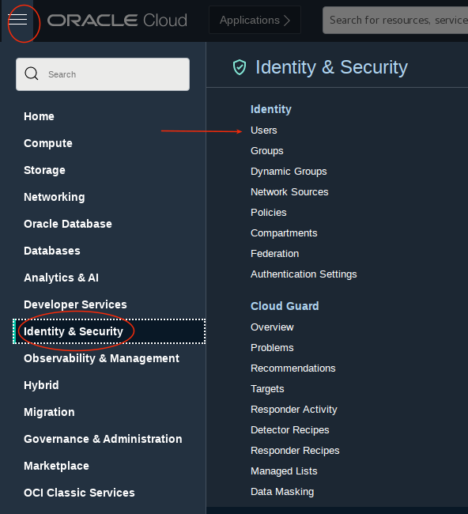
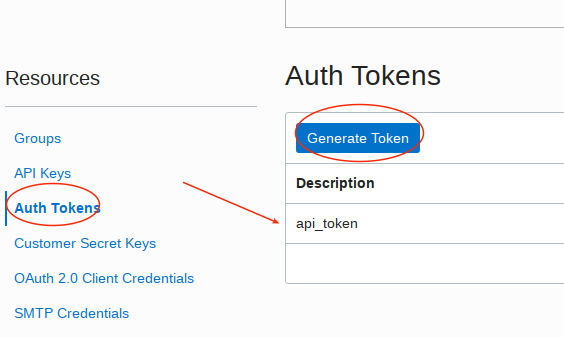
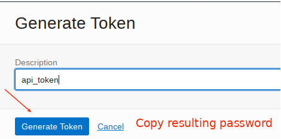

# Cloud Coaching:  Oracle Autonomous Database Features for Supporting Application Development Across Cloud Services

Derrick Cameron, Steve Nichols
July, 2023

## **Related Recordings**

- [DBMS_CLOUD Package](https://www.youtube.com/watch?v=RvIPCXiz_vE)
- [ORDS Install and Config](https://www.youtube.com/watch?v=RvIPCXiz_vE)
- [Autonomous Database for Legacy Database Developers](https://www.youtube.com/watch?v=EbrG4-K-TzY)

## **Export Data to Object Storage and Query Data in Object Storage** 

```
SELECT * FROM DBMS_CLOUD.LIST_OBJECTS('API_TOKEN', '<object storage bucket URI>');

BEGIN
  DBMS_CLOUD.EXPORT_DATA(
    credential_name => 'API_TOKEN',
    file_uri_list   => '<object storage bucket URL with file name pattern',
    query           => 'SELECT 777 project_id, sysdate shapshot_date, s.* FROM sales_small s',
    format          => JSON_OBJECT('type' value 'csv', 'delimiter' value ',','maxfilesize' value 999999999,'header' value true)    
    );
END;
/

begin
dbms_cloud.delete_object(
    credential_name => 'API_TOKEN',
    object_uri => 'https://objectstorage.us-ashburn-1.oraclecloud.com/n/natdcshjumpstartprod/b/sales/o/sales_1_20230706T221507652863Z.csv');
end;
/

begin
dbms_cloud.create_external_table (
table_name => 'sales_ext',
credential_name => 'api_token',
file_uri_list => 'https://objectstorage.us-ashburn-1.oraclecloud.com/n/natdcshjumpstartprod/b/sales/o/sales_1_*.csv',
format => json_object('delimiter' value ',','type' value 'csv', 'skipheaders' value '1','logretention' value 2),
column_list => 'project_id number,
    snapshot_date date,
    prod_id number,
    cust_id number,
    time_id date,
    channel_id number,
    promo_id number,
    quantity_sold number,
    amount_sold number(20,2),
    employee_id number');
end;
/
```

## **Common Customer Use Cases**

- Navigate to your users

  

- Select the your cloud user and then select *Auth Tokens* on the left and then *Generate Token*.  I called my api key *api_token*.  Be sure to copy the generated key.

  

  

